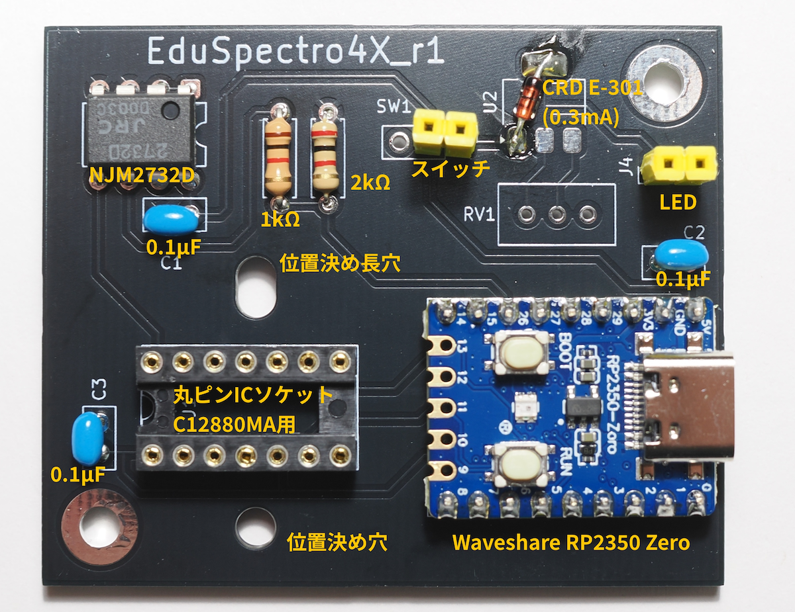

# EduSpectro4X
ファームウェア・電子回路
[📖 総合ガイド（Webサイト）はこちら](https://eduspectro.github.io/)

*   **概要**: 「RP2350とC12880MAを組み合わせた分光器の心臓部です」
*   **分光性能諸元**:
    *   測定波長範囲: 340 nm 〜 850 nm（紫外線〜可視光〜近赤外線）
    *   物理画素数: 288 画素（センサー本来の受光素子数）
    *   論理出力点数: 1149 点（4倍オーバーサンプリング間）
    *   波長分解能 (FWHM): 約 10 nm 〜 15 nm
    *   階調分解能: 16bit相当（12bit ADC × 10回累積処理）
    *   最短露光時間: 20 ms（0.02秒）
    *   データ更新間隔: 約 20 ms 〜（露光設定に依存）
*   **特徴**: PIOによる高速制御、10回累積計測してによるノイズ軽減、Catmull-Rom補間など。
*   **必要な環境**:
    *   Arduino IDEのバージョン1.8.19
    *   導入が必要なボードマネージャー（Raspberry Pi Pico/RP2350）
    *   ボード：Waveshare RP2350 Zero、
*   **ハードウェアについて**:
 <dr>

    *   部品リスト：マイコンボード Waveshare RP2350 Zero、分光センサー C12880MA、オペアンプ NJM2732D、0.3mA定電流素子、セラミックコンデンサ 0.1μF(3個)、トグルスイッチ、14ピンICソケット（丸ピン）、ロープロファイルピンヘッダー（オス）、ヘッダーピン(メス)、L型ピンヘッダ（オス）
*   [KiCadの使い方について](docs/HowToMakePCB_KiCad×GeminiAI.pdf) 
*   **使い方**:
*   [Arduino IDEでの書き込み方](docs/ArduinoIDE_Write_Firm.pdf)
*   Raspberry Pi Pico2などのWebでの記事も参照してください。

